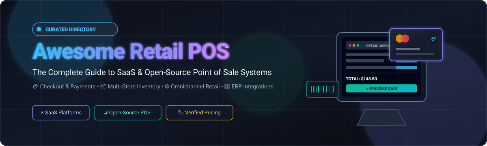

<div align="center">

# 🛒 Awesome Retail POS

<p align="center">
  
</p>

### 🌟 A Curated Directory of SaaS & Open-Source Point of Sale (POS) Systems, Retail Management Software, Omnichannel Platforms, and Self-Hosted Checkout Infrastructure 🚀

<p align="center">
  <a href="https://github.com/ishandutta2007/Awesome-Awesome-Awesome"></a>
  <a href="https://discord.gg/jc4xtF58Ve"></a>
  <a href="https://github.com/ishandutta2007/Awesome-Retail-POS/stargazers"></a>
  <a href="https://github.com/ishandutta2007/Awesome-Retail-POS/network/members"></a>
  <a href="https://github.com/ishandutta2007/Awesome-Retail-POS/blob/main/LICENSE"></a>
  <a href="https://github.com/ishandutta2007/Awesome-Retail-POS/pulse"></a>
  <a href="https://github.com/ishandutta2007"></a>
</p>

<p align="center">
  <b>Search, compare, and discover the best commercial and open-source retail POS solutions for brick-and-mortar shops, omnichannel chains, restaurants, and ecommerce brands.</b>
</p>

---

</div>

## 📑 Table of Contents

* [📊 Market Overview & Industry Dynamics](#-market-overview--industry-dynamics)
* [⚡ SaaS / Hosted Retail POS Platforms](#-saashosted-retail-pos-platforms)
* [🔓 Open-Source POS Platforms & Repositories](#-open-source-pos-platforms--repositories)
* [🏗️ Open-Source Retail Architecture & Deep Dives](#️-open-source-retail-architecture--deep-dives)
  * [Odoo POS](#-odoo-pos)
  * [Open Source Point of Sale (OSPOS)](#-open-source-point-of-sale-ospos)
  * [NexoPOS](#-nexopos)
  * [uniCenta oPOS](#-unicenta-opos)
  * [RetailPOS](#-retailpos)
* [🧩 Open-Source ERP-Based POS Comparison](#-open-source-erp-based-pos-comparison)
* [🍽️ Restaurant & Hospitality POS](#️-restaurant--hospitality-pos)
* [🌐 Retail Commerce Infrastructure](#-retail-commerce-infrastructure)
* [📊 POS Capability Matrix](#-pos-capability-matrix)
* [⚖️ SaaS vs Open Source POS](#️-saas-vs-open-source-pos)
* [🏆 Recommended Shortlist](#-recommended-shortlist)
* [🔌 Payment & Fiscalization Infrastructure](#-payment--fiscalization-infrastructure)
* [🚀 Open-Source Opportunities](#-open-source-opportunities)
* [🤝 How to Contribute](#-how-to-contribute)
* [📈 Star History](#-star-history)
* [📜 Disclaimer](#-disclaimer)

---

## 📊 Market Overview & Industry Dynamics

> 💡 **Sector Market Size & Concentration Dynamics:**
> The global retail Point of Sale (POS) software and payment terminals market is valued at approximately **$28.5 Billion in 2025–2026** and is projected to expand to **$48.5+ Billion by 2030** (CAGR of ~11.8%). The retail POS market is **moderately to highly fragmented** rather than a "winner-take-all" market. This fragmentation is driven by diverse vertical requirements (e.g., grocery scales, fashion matrix inventory, restaurant kitchen displays), regional payment processors and banking compliance, local fiscalization laws (such as TSE in Germany or NF525 in France), and differing scale tiers ranging from enterprise multi-lane hypermarkets down to micro-retail pop-ups.

---

## ⚡ SaaS / Hosted Retail POS Platforms

Below is a curated comparison of leading commercial SaaS Point of Sale platforms, sorted in **descending order by company scale** (market capitalization / valuation / annual revenue).

| Platform | Company Scale (Valuation / Revenue) | Key Focus & Capabilities | Pricing (Starting Tier) | Free Tier / Free Trial Limits |
| :--- | :--- | :--- | :--- | :--- |
| **Oracle Retail Xstore** | **~$380B+ Market Cap** (Oracle Corp. / ~$53B Annual Revenue) | Tier-1 enterprise POS suite for multi-lane department stores, specialty chains, and global omnichannel retailers. | Starts at **~$150/user/mo** (or perpetual enterprise license starting from ~$5,000/lane plus annual maintenance). | **Structured POC sandbox evaluation** (typically 30 days) via Oracle Retail specialists; live environment setup during RFP/evaluation phase. |
| **Clover** | **~$120B+ Market Cap** (Fiserv, Inc. / ~$19B Annual Revenue; $2B+ Clover GMV/segment) | Hardware-centric cloud POS and payments platform with a wide third-party app marketplace and employee management. | Software starts at **$4.95/mo** (Payments tier) to **$39.95/mo** (Essentials tier) / **$89.95/mo** (Standard tier) for retail software (hardware sold separately). | **Up to 90-day free trial** on SaaS subscription fees for Essentials/Growth plans for new eligible merchants; requires Clover hardware purchase and active transaction processing. |
| **Shopify POS** | **~$105B+ Market Cap** (Shopify Inc. / ~$7.5B Annual Revenue) | Omnichannel POS tightly integrated with Shopify commerce ecosystem; synchronizes in-store and online catalog, inventory, orders, and customer profiles. | Starts at **$5/mo** (Shopify Starter) or **$29/mo** (Basic Shopify, billed annually; $39/mo monthly) with Shopify POS Lite included; Shopify POS Pro add-on is **$89/mo per location**. | **3-day free trial** with access to POS app and back-office; live checkout & payment processing disabled until a paid plan is selected (no permanent free tier). |
| **Square** | **~$45B+ Market Cap** (Block, Inc. / ~$22B Annual Revenue) | Cloud POS and payment ecosystem combining checkout, inventory, CRM, staff, loyalty, and online ordering. | **$0/mo** (Free Plan) with standard processing fees of 2.6% + 15¢ per in-person transaction; Square for Retail Plus starts at **$89/mo per location**. | **Free forever plan** with unlimited items, unlimited sales volume, 1 location, and basic inventory; **30-day free trial** for Square for Retail Plus. |
| **Heartland Retail** | **~$25B+ Market Cap** (Global Payments Inc. / ~$9.5B Annual Revenue) | Cloud POS and retail operations platform emphasizing multi-store inventory, customer tracking, purchasing, and analytics. | Starts at **$89/mo per station** (billed annually). | **14-to-30-day sandbox demo trial** provided via sales onboarding with full multi-location and catalog simulation tools. |
| **Toast** | **~$18B+ Market Cap** (Toast, Inc. / ~$4.2B Annual Revenue) | Restaurant and hospitality POS ecosystem covering order management, kitchen display systems, inventory, and online ordering. | **$0/mo** (Quick Start Starter Kit with processing rate of 2.99% + 15¢) or **$69/mo** (Standard Point of Sale plan). | **Free forever Starter plan** for up to 2 terminals with core POS & reporting; add-on modules (loyalty, marketing, scheduling) require paid subscription upgrades. |
| **SumUp POS** | **~$8.5B Valuation** (SumUp Ltd. / ~$600M+ Annual Revenue) | Mobile card payment and cloud POS ecosystem designed for micro-merchants and growing small retailers. | **$0/mo** (Pay-as-you-go POS app with 2.6% + 10¢ transaction fee) or **$99/mo** (SumUp POS Lite dedicated retail register). | **Free forever POS mobile app plan** for unlimited catalog items and basic sales tracking; **7-day to 30-day free trial** on premium software plans (POS Pro / Payments Plus). |
| **Cegid Retail** | **~$6.5B (€5.5B+) Valuation** (Cegid Group / Silver Lake & KKR / ~$800M+ Revenue) | Global unified commerce and POS platform specializing in luxury, fashion, beauty, and specialty store chains. | Starts at **€159/mo per store** (base cloud subscription module). | **Interactive solution sandbox & pilot trial** provided during pre-sales scoping for store workflows and catalog testing. |
| **Lightspeed Retail** *(incl. Vend & ShopKeep)* | **~$2.2B Market Cap** (Lightspeed Commerce Inc. / ~$900M+ Annual Revenue) | Retail-focused POS with advanced multi-store inventory, vendor catalogs, purchasing, reporting, and customer loyalty. | Starts at **$109/mo** (Basic plan, billed annually) or **$149/mo** (Core plan, billed annually) per register. | **14-day free trial** with full access to inventory, POS register, and analytics features; testing restricted to demo/sandbox data before merchant activation. |
| **NCR Voyix** | **~$2.0B Market Cap** (NCR Voyix Corp. / ~$3.8B Annual Revenue) | Enterprise retail technology platform covering high-volume POS, self-checkout, digital commerce, and store operations. | Starts at **$108/mo per lane** (Aloha Cloud / retail base tier; enterprise scale with volume pricing). | **Guided proof-of-concept sandbox trial** (typically 14–30 days) via enterprise sales engineering for architecture evaluation. |
| **Aptos** | **~$1.8B Valuation** (Aptos Retail / Goldman Sachs Affiliates / ~$400M+ Revenue) | Large-scale enterprise cloud retail platform covering POS, unified commerce, CRM, merchandising, and order management. | Starts at **~$125/store/mo** (base SaaS unit pricing in multi-year enterprise contracts). | **Customized enterprise pilot evaluation** (typically 30–60 days) in a test staging environment with simulated store transactions. |
| **Revel Systems** | **~$250M Acquisition Valuation** (Shift4 Payments / Shift4 ~$7B Market Cap / ~$120M+ Revenue) | Cloud iPad POS designed for multi-location retail, quick-service, and hospitality operations with real-time reporting. | Starts at **$99/mo per terminal** (billed annually with 3-year processing agreement). | **30-day guided interactive demo & sandbox evaluation** with product engineers; full system configuration testing without live payment settlement. |
| **EPOS Now** | **~$400M+ Valuation** (EPOS Now Ltd. / ~$60M+ Annual Revenue) | Modular cloud POS for retail and hospitality with inventory tracking, staff control, and external hardware support. | Software starts at **$39/mo** (or complete hardware + software bundle starting from $349 upfront + $39/mo). | **30-day free software trial** with full access to cloud back-office and virtual POS register testing (physical hardware not included in trial). |
| **LS Retail** *(LS Central / LS Express)* | **~$300M+ Valuation** (Aptos Group / LS Retail ehf. / ~$75M+ Revenue) | Unified retail and hospitality POS ecosystem built natively on Microsoft Dynamics 365 Business Central. | Starts at **$35/user/mo** (for LS Express) and **~$85/user/mo** (for LS Central base licensing + Dynamics BC seat). | **30-day free trial** available via Microsoft AppSource for LS Express/LS Central on Dynamics 365 (limited to sandbox database and test data). |
| **Helcim** | **~$150M+ Valuation** ($40M+ Series B / ~$5B+ Annual Processed Volume) | Merchant services and payment-centric POS platform offering built-in virtual terminal, POS app, and inventory management. | **$0/mo subscription fee** (interchange-plus transaction fee starting at 0.40% + 8¢ above interchange for in-person). | **Free forever platform access** with unlimited users, unlimited devices/registers, full invoicing, inventory tracking, and virtual POS (strictly per-transaction fee, zero monthly software fee). |
| **Petpooja** | **~$150M+ Valuation** (Prayaan Capital / Peak XV backed / ~$20M+ Revenue) | Restaurant and food-retail POS platform providing billing, menu management, online order integration, and analytics. | Starts at **₹10,000/year** (Base single-outlet restaurant POS plan). | **7-day guided onboarding demo/trial environment** with full access to menu setup, KDS, and billing simulations. |
| **Marg ERP** | **~$100M+ Valuation** (Marg ERP Ltd. / ~$15M+ Annual Revenue) | Inventory and accounting ERP software with integrated retail and pharmacy POS billing. | Starts at **₹5,550/year** (Nano edition) or **₹10,300/year** (Basic edition; cloud access starting at ~₹50/day). | **7-day free trial / free demo edition** capped at 50 bills/transactions and sample master database. |
| **GoFrugal** | **~$80M+ Valuation** (GoFrugal Technologies / ~$12M+ Annual Revenue) | Comprehensive retail, restaurant, and distribution POS software with multi-store inventory and billing capabilities. | Starts at **$13/mo per register** (Starter Cloud edition, or ~$375 one-time license). | **30-day free trial** with full access to retail billing, inventory management, and reporting modules (testing up to 500 SKUs). |
| **Erply** | **~$60M+ Valuation** (Erply Ltd. / ~$15M+ Annual Revenue) | Cloud retail POS and inventory management platform with real-time stock control, CRM, and omnichannel APIs. | Starts at **$39/mo** (billed annually, or $59/mo billed monthly) for Brick & Mortar plan. | **60-day free trial** with access to 1 register, up to 1,000 products, cloud back-office, and inventory tools (no permanent free tier). |
| **Loyverse** | **~$25M+ Valuation** (Loyverse Inc. / ~$5M+ Annual Revenue) | Cloud mobile POS and inventory system designed for small retail, cafes, and boutique shops. | **$0/mo** (Free Core POS); paid add-ons start at $5/mo (Unlimited receipts) and $25/mo each for Employee Management and Advanced Inventory. | **Free forever core plan** with unlimited transactions, unlimited items, 1 store location, and basic inventory tracking; **14-day free trial** on all paid add-ons. |

---

## 🔓 Open-Source POS Platforms & Repositories

The open-source POS ecosystem provides developer control, database ownership, offline-first reliability, and freedom from SaaS subscription lock-in.

Below are the notable open-source and self-hostable POS projects, **sorted in descending order by GitHub Stars ⭐**. Each project name includes a live star badge linking directly to the repo's stargazers page:

| Project | GitHub_Stars | License | Primary Tech Stack | Description & Positioning |
| :--- | :---: | :---: | :--- | :--- |
| **[Odoo POS](https://github.com/odoo/odoo)** | [](https://github.com/odoo/odoo/stargazers) | LGPL-3.0 | Python, JavaScript (OWL), PostgreSQL | Full-suite web POS tightly integrated with Odoo ERP, inventory, purchasing, CRM, accounting, and eCommerce. |
| **[ERPNext POS](https://github.com/frappe/erpnext)** | [](https://github.com/frappe/erpnext/stargazers) | GPL-3.0 | Python, Frappe Framework, MariaDB/PostgreSQL | Built-in POS module within ERPNext; connects physical sales directly with general ledger, warehouse stock, and billing. |
| **[Dolibarr](https://github.com/Dolibarr/dolibarr)** | [](https://github.com/Dolibarr/dolibarr/stargazers) | GPL-3.0 | PHP, JavaScript, MySQL/PostgreSQL | All-in-one ERP & CRM suite featuring modular Point of Sale (TakePOS) for SMB retail shops and bars. |
| **[Open Source POS (OSPOS)](https://github.com/opensourcepos/opensourcepos)** | [](https://github.com/opensourcepos/opensourcepos/stargazers) | MIT | PHP (CodeIgniter), Bootstrap, MySQL | Lightweight, dedicated web-based POS application designed for small retailers with inventory, employee, and reporting tools. |
| **[NexoPOS](https://github.com/Blair2004/NexoPOS)** | [](https://github.com/Blair2004/NexoPOS/stargazers) | GPL-3.0 | PHP (Laravel), Vue.js, Tailwind CSS | Modern, extendable web POS & store management system with multi-store support, cash drawer controls, and module marketplace. |
| **[Apache OFBiz POS](https://github.com/apache/ofbiz-framework)** | [](https://github.com/apache/ofbiz-framework/stargazers) | Apache-2.0 | Java, Groovy, XML | Enterprise-grade, highly customizable open-source ERP and commerce framework with terminal POS support. |
| **[Store-POS](https://github.com/tngoman/Store-POS)** | [](https://github.com/tngoman/Store-POS/stargazers) | MIT | Electron, React, Express, SQLite | Desktop Electron POS for local multi-terminal networks, item catalog photos, fast offline sales, and receipt printing. |
| **[Lakasir](https://github.com/lakasir/lakasir)** | [](https://github.com/lakasir/lakasir/stargazers) | GPL-3.0 | PHP, Vue.js, MySQL | Modern, simple open-source cashier and inventory system for small-to-medium retail shops and food kiosks. |
| **[Triangle POS](https://github.com/FahimAnzamDip/triangle-pos)** | [](https://github.com/FahimAnzamDip/triangle-pos/stargazers) | MIT | PHP (Laravel 10), Livewire 3, Bootstrap 4 | Free open-source inventory management and Point of Sale system with sales tracking, customer credits, and expense records. |
| **[TailPOS](https://github.com/bailabs/tailpos)** | [](https://github.com/bailabs/tailpos/stargazers) | GPL-3.0 | Flutter, Dart, CouchDB, ERPNext | Offline-first mobile/tablet POS app designed to synchronize sales and stock with ERPNext via REST APIs. |
| **[POS-Awesome](https://github.com/ucraft-com/POS-Awesome)** | [](https://github.com/ucraft-com/POS-Awesome/stargazers) | AGPL-3.0 | Vue.js, Vuetify, Python (Frappe) | High-performance modern POS UI for ERPNext with offline-first caching, promotions, discounts, and payment methods. |
| **[Samarium](https://github.com/shyamsitaula/samarium)** | [](https://github.com/shyamsitaula/samarium/stargazers) | AGPL-3.0 | PHP (Laravel), Livewire, Docker | Modular open-source business management system combining ERP, POS checkout, invoicing, and inventory control. |
| **[Laravel POS](https://github.com/angkosal/laravel-pos)** | [](https://github.com/angkosal/laravel-pos/stargazers) | MIT | PHP (Laravel), Vue.js, Bootstrap | Clean, responsive web-based Point of Sale application featuring order carts, barcode scanning, and sales reports. |
| **[Scipio ERP](https://github.com/ilscipio/scipio-erp)** | [](https://github.com/ilscipio/scipio-erp/stargazers) | Apache-2.0 | Java, FreeMarker, Apache OFBiz core | Scalable enterprise commerce, warehouse management, and omnichannel POS infrastructure framework. |
| **[OCA POS Modules](https://github.com/OCA/pos)** | [](https://github.com/OCA/pos/stargazers) | AGPL-3.0 | Python, JavaScript (Odoo) | Official Odoo Community Association repository hosting hundreds of production-ready POS extensions and drivers. |
| **[URY](https://github.com/ury-erp/ury)** | [](https://github.com/ury-erp/ury/stargazers) | AGPL-3.0 | Python (Frappe), Vue.js, ERPNext | Open-source restaurant POS and kitchen management system powered by ERPNext with table management and KDS. |
| **[Tryton POS](https://github.com/tryton/tryton)** | [](https://github.com/tryton/tryton/stargazers) | GPL-3.0 | Python, GTK/Web, PostgreSQL | Modular business platform with POS integration modules connecting retail tills directly with accounting and inventory. |
| **[Floreant POS](https://github.com/fat-tire/floreantpos)** | [](https://github.com/fat-tire/floreantpos/stargazers) | MRPL / MPL | Java, Apache Derby / MySQL | Touchscreen-first desktop POS application specifically architected for restaurants, table service, and kitchen printers. |
| **[uniCenta oPOS](https://github.com/herbiehp/unicenta)** | [](https://github.com/herbiehp/unicenta/stargazers) | GPL-3.0 | Java, MySQL/PostgreSQL | Mature, multi-terminal desktop POS descendant of Openbravo POS for barcode scanning, cash drawers, and customer displays. |
| **[Chromis POS](https://github.com/ChromisPos/ChromisPOS)** | [](https://github.com/ChromisPos/ChromisPOS/stargazers) | GPL-3.0 | Java, MySQL | Open-source POS derived from uniCenta/Openbravo with dedicated kitchen display and barcode hardware support. |
| **[RetailPOS](https://github.com/hubertchathi/retailpos)** | [](https://github.com/hubertchathi/retailpos/stargazers) | Apache-2.0 | TypeScript, Rust, WebAssembly | Composable, offline-first physical retail POS built to sync with Shopify, WooCommerce, Magento, and Sylius. |
| **[Posnic POS](https://github.com/Posnic/POS)** | [](https://github.com/Posnic/POS/stargazers) | AGPL-3.0 | JavaScript, Electron, MongoDB | Free offline-first open source POS and billing software for retail shops and restaurants, with inventory, reports, desktop packaging, online/offline workflows, and the official site at [posnic.io](https://posnic.io/). |

---

## 🏗️ Open-Source Retail Architecture & Deep Dives

### 🏪 Odoo POS

```text
                         ODOO POS
                            │
       ┌────────────────────┼────────────────────┐
       │                    │                    │
      POS                INVENTORY            CRM
       │                    │                    │
       ├────────────────────┼────────────────────┤
       │                    │                    │
   Payments             Purchasing          Accounting
       │                    │                    │
       └────────────────────┼────────────────────┘
                            │
                         Ecommerce
```

* **Why it matters:** Odoo POS runs directly inside a modern web browser and provides full offline synchronization.
* **Unified Data Flow:** Cashier checkout instantly reflects in the central general ledger, replenishes inventory, triggers purchase orders, and updates customer loyalty points.

---

### 📦 Open Source Point of Sale (OSPOS)

```text
                 OPEN SOURCE POS (OSPOS)
                            │
         ┌──────────────────┼──────────────────┐
         │                  │                  │
       SALES            INVENTORY          CUSTOMERS
         │                  │                  │
         └──────────────────┼──────────────────┘
                            │
                         REPORTS
                            │
                       WEB BROWSER
                            │
                    PHP + MySQL Backend
```

* **Focus:** Lightweight, self-contained, and dedicated specifically to Point of Sale operations without the overhead of full enterprise ERP suites.
* **Best for:** Small standalone shops, gift stores, non-profits, and educational institutions wanting a simple LAMP/Docker deployment.

---

### 🛍️ NexoPOS

* **Modern Stack:** Built on **Laravel**, **Vue.js**, and **Tailwind CSS**, making it exceptionally developer-friendly and extensible.
* **Features:** Multi-store management, cashier shifts, barcode label generator, customer rewards, stock adjustments, and custom module hooks.

---

### 🖥️ uniCenta oPOS

* **Hardware Native:** Java-based architecture designed for standalone hardware terminals, pole customer displays, serial ESC/POS printers, and mechanical cash drawers.
* **Proven Stability:** Decades of production deployments across retail stores, delis, and hospitality chains worldwide.

---

### 🔗 RetailPOS

```text
                     RETAILPOS ENGINE
                            │
       ┌────────────────────┼───────────────────┐
       │                    │                   │
    Shopify            WooCommerce           Magento
       │                    │                   │
       └────────────────────┼───────────────────┘
                            │
                     POS TERMINAL APP
                            │
          ┌─────────────────┼─────────────────┐
          │                 │                 │
       Offline           Orders           Inventory
          │                 │                 │
          └─────────────────┼─────────────────┘
                            │
                         Payments
```

* **Composable Approach:** Rather than reinventing the eCommerce backend, RetailPOS connects local physical checkout terminals directly to existing eCommerce platforms.

---

## 🧩 Open-Source ERP-Based POS Comparison

| Platform | Built-in POS | Complete ERP | Inventory Control | General Ledger Accounting | Omnichannel Ecommerce | Primary Positioning |
| :--- | :---: | :---: | :---: | :---: | :---: | :--- |
| **[Odoo](https://github.com/odoo/odoo)** | ✅ Native | ✅ Yes | ✅ Advanced | ✅ Multi-currency | ✅ Integrated | Full Modular Business Platform |
| **[ERPNext](https://github.com/frappe/erpnext)** | ✅ Native | ✅ Yes | ✅ Advanced | ✅ Double-entry | ✅ Integrated | Modern Frappe Open-Source ERP |
| **[Dolibarr](https://github.com/Dolibarr/dolibarr)** | ✅ TakePOS | ✅ Yes | ✅ Standard | ✅ Standard | ✅ Via Modules | Lightweight SMB ERP & CRM |
| **[Apache OFBiz](https://github.com/apache/ofbiz-framework)** | ✅ Web POS | ✅ Yes | ✅ Enterprise | ✅ Enterprise | ✅ Enterprise | Enterprise Commerce Framework |
| **[Tryton](https://github.com/tryton/tryton)** | ✅ Via Modules | ✅ Yes | ✅ Advanced | ✅ Advanced | ✅ Via Modules | Highly Modular Python ERP |

---

## 🍽️ Restaurant & Hospitality POS

| Project | Primary Focus & Specialization | Key Restaurant Features |
| :--- | :--- | :--- |
| **[Floreant POS](https://github.com/fat-tire/floreantpos)** | Restaurant, Bar, & Cafe POS | Floor plans, table allocation, kitchen ticket routing, split bills, tip management. |
| **[URY](https://github.com/ury-erp/ury)** | ERPNext-Powered Restaurant ERP | Kitchen Display System (KDS), cloud sync, digital menu, recipe costing. |
| **[Chromis POS](https://github.com/ChromisPos/ChromisPOS)** | Hospitality & Quick-Service Retail | Dedicated kitchen screen add-on, caller ID support, customer-facing display. |
| **[Odoo POS Restaurant](https://github.com/odoo/odoo)** | Full-Service Dining & Bars | Graphical floor plan editor, bill splitting, order kitchen printing, mobile waiter tablet. |
| **[POS-Awesome](https://github.com/ucraft-com/POS-Awesome)** | Quick Service & Retail for ERPNext | Fast touch order entry, combo deals, table tags, and kitchen printer routing. |

---

## 🌐 Retail Commerce Infrastructure

Modern unified commerce POS architectures serve as the bridge between online customers and physical retail stores:

```text
                         CUSTOMER
                            │
               ┌────────────┴────────────┐
               │                         │
            ONLINE                    IN-STORE
          (Web/App)                  (POS Till)
               │                         │
          Ecommerce                     POS
               │                         │
               └────────────┬────────────┘
                            │
                    COMMERCE PLATFORM
                            │
        ┌───────────────────┼───────────────────┐
        │                   │                   │
     Inventory           Customers           Orders
        │                   │                   │
        ├───────────────────┼───────────────────┤
        │                   │                   │
     Loyalty             Payments            Pricing
        │                   │                   │
        └───────────────────┼───────────────────┘
                            │
                        Analytics
```

---

## 📊 POS Capability Matrix

| Capability | SaaS / Hosted Platforms | Open-Source POS Options |
| :--- | :--- | :--- |
| 🛒 **Basic Fast Checkout** | Shopify POS, Square, Clover | OSPOS, NexoPOS, Store-POS, uniCenta |
| 📦 **Multi-Store Inventory** | Shopify, Lightspeed, Square | Odoo, ERPNext, Dolibarr, OFBiz |
| 🏢 **Multi-Location Hierarchy** | Shopify, Lightspeed, Clover | Odoo, ERPNext, Scipio ERP |
| 🌐 **eCommerce Sync** | Shopify, Square, Lightspeed | Odoo, ERPNext, RetailPOS, Medusa |
| 💳 **Integrated Card Payments** | Square, Clover, Shopify, Toast | External Payment Terminals / Stripe / Adyen |
| 🎁 **Loyalty & Rewards** | Shopify, Square, Lightspeed | Odoo, ERPNext, NexoPOS |
| 👥 **Customer Relationship (CRM)** | Most major SaaS POS | Odoo, ERPNext, Dolibarr, OSPOS |
| 👨‍💼 **Employee Shift & Time Clock** | Shopify, Square, Clover | Odoo, ERPNext, NexoPOS, Floreant |
| 📑 **Purchase Orders & Vendors** | Lightspeed, Shopify ecosystem | Odoo, ERPNext, Dolibarr, OFBiz |
| 📊 **General Ledger Accounting** | Third-party integrations | Odoo, ERPNext, Dolibarr, OFBiz |
| 📶 **Offline-First Resilience** | Vendor-dependent | RetailPOS, Store-POS, TailPOS, POS-Awesome |
| 🖨️ **ESC/POS Hardware Support** | Certified proprietary hardware | Strong support for Epson, Star, Citizen |
| 💻 **Source Code Modification** | ❌ No | ✅ Full Source Access |
| 🗄️ **Database Ownership** | ❌ Vendor-Managed Cloud | ✅ Self-Hosted (PostgreSQL/MySQL/SQLite) |
| 🔒 **Vendor Lock-in Risk** | Medium to High | Minimal |

---

## ⚖️ SaaS vs Open Source POS

### ☁️ When to Choose Commercial / SaaS POS
* Need **ready-to-use payment processing** with instant hardware terminal pairing.
* Require **24/7 dedicated telephone & live chat vendor support**.
* Want zero infrastructure management, automatic PCI compliance updates, and fully managed cloud backups.
* Leading choices: **Shopify POS, Square, Lightspeed Retail, Clover, Toast, Revel Systems**.

### 💻 When to Choose Open-Source POS
* Require **100% data sovereignty and localized database ownership**.
* Need deep custom business logic, custom payment gateway adapters, or local hardware drivers.
* Operates in remote areas requiring guaranteed **offline-first local network operation**.
* Integration with custom or existing ERPs (Odoo, ERPNext, Dolibarr, Apache OFBiz).
* Leading choices: **Odoo POS, ERPNext POS, OSPOS, NexoPOS, Store-POS, Dolibarr**.

---

## 🏆 Recommended Shortlist

* **🥇 Best Overall Open-Source ERP + POS:** [Odoo POS](https://github.com/odoo/odoo) & [ERPNext POS](https://github.com/frappe/erpnext)
* **🥇 Best Dedicated Web POS for SMBs:** [OSPOS](https://github.com/opensourcepos/opensourcepos) & [NexoPOS](https://github.com/Blair2004/NexoPOS)
* **🥇 Best Desktop Local-First POS:** [Store-POS](https://github.com/tngoman/Store-POS) & [uniCenta oPOS](https://github.com/herbiehp/unicenta)
* **🥇 Best Restaurant Open-Source POS:** [Floreant POS](https://github.com/fat-tire/floreantpos) & [URY](https://github.com/ury-erp/ury)
* **🥇 Best Omnichannel Headless POS:** [RetailPOS](https://github.com/hubertchathi/retailpos)

---

## 🔌 Payment & Fiscalization Infrastructure

When deploying an open-source POS, remember that payment terminals and fiscal compliance require external infrastructure:

```text
    ┌────────────────────────────────────────────────────────┐
    │                 Open-Source POS UI                    │
    └──────────────────────────┬─────────────────────────────┘
                               │
               ┌───────────────┴───────────────┐
               ▼                               ▼
    ┌───────────────────────┐       ┌───────────────────────┐
    │ Payment Terminal SDK  │       │ Fiscal Memory / Cloud │
    │ (Stripe Terminal /    │       │ (Germany TSE /        │
    │  Adyen / Square SDK)  │       │  France NF525 / etc.) │
    └───────────────────────┘       └───────────────────────┘
```

---

## 🚀 Open-Source Opportunities

The retail tech landscape is evolving rapidly. High-impact areas for new open-source retail projects include:

1. 🤖 **AI-Powered Retail Copilots:** Local LLM agents for automated reordering, shrinkage detection, and demand forecasting.
2. 📱 **Mobile Self-Checkout PWA:** Customer-facing barcode scanning apps running locally in stores.
3. ⚡ **Universal Payment Driver Abstraction:** Standardized WebSockets/WebUSB layer for all major card reader protocols.
4. 🔄 **Bi-directional Commerce Connectors:** Pluggable sync engines between self-hosted POS and Shopify / WooCommerce / Medusa.
5. 🛡️ **Zero-Config Fiscalization Middleware:** Modular adapters for European, Latin American, and Asian fiscal receipt hardware.

---

## 🤝 How to Contribute

Contributions are welcome! Please follow these guidelines:

1. Fork the repository on GitHub.
2. Add your suggested POS software, tool, or infrastructure project to [README.md](README.md).
3. Ensure open-source projects include repository links, licenses, and star badges.
4. Keep the tabular formatting and ensure verified pricing/free tier data.
5. Submit a Pull Request with a clear description of why the project belongs on this list.

---

## 📈 Star History

[](https://star-history.dera.page/#ishandutta2007/Awesome-Retail-POS&type=date&legend=top-left)

---

## 📜 Disclaimer

* This is a **community-curated list** provided for informational and educational purposes.
* Product names, logos, and trademarks belong to their respective owners.
* Always test hardware compatibility, payment processing security (PCI-DSS), and regional fiscal compliance before deploying any POS in a live retail environment.

---

<div align="center">

Made with ❤️ by the open retail tech community. **Star ⭐ this repo if you find it helpful!**

</div>
